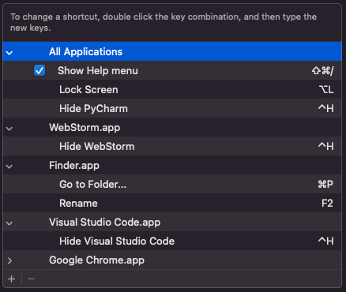

# MacOS Windows-like Keymaps

This project provides a collection of Karabiner-Elements configurations to make your MacOS keyboard behave more like Windows, making the transition between operating systems smoother.

## Required System Shortcut Adjustments

Before using these keymaps, you need to adjust some system shortcuts in macOS System Settings. Here are the necessary changes:

### 1. Mission Control Shortcuts

- Disable or change the default Mission Control shortcuts to avoid conflicts

### 2. Spotlight Search

- Update the default Spotlight shortcut from `Command + Space` to `Option + Space` and `Option + Command + Space`.

### 3. Input Sources

- Adjust the keyboard input source switching shortcut

### 4. Launchpad and Dock

- Change the default Launchpad shortcut

### 5. Keyboard Modifier Keys

- Ensure your modifier keys are set correctly
- Recommended: Swap the `Control` key with the `Command` key

### 6. App Shortcuts


- Review and adjust any application-specific shortcuts

### 7. Siri Shortcuts

- Change the default Siri shortcut

### 8. Keyboard Shortcuts

- Review and adjust any keyboard shortcuts to match with the Karabiner shortcuts

## Prerequisites

- MacOS (tested on MacOS Ventura and later)
- [Karabiner-Elements](https://karabiner-elements.pqrs.org/) installed on your system

## Installation

1. First, install Karabiner-Elements from the [official website](https://karabiner-elements.pqrs.org/)
2. Open Karabiner-Elements and grant the necessary permissions
3. Navigate to the `~/.config/karabiner/assets/complex_modifications/` directory:
   ```bash
   mkdir -p ~/.config/karabiner/assets/complex_modifications/
   ```
4. Copy the JSON configuration files from this repository's `karabiner` directory to the complex_modifications directory:
   ```bash
   cp karabiner/*.json ~/.config/karabiner/assets/complex_modifications/
   ```
5. Open Karabiner-Elements
6. Go to the "Complex Modifications" tab
7. Click "Add rule"
8. Enable the rules you want to use

## Available Keymaps

### Windows-like Shortcuts (`windows_shortcuts.json`)

This configuration provides the following Windows-like shortcuts:

- `Alt + Tab`: Switch between applications (Windows-style)
- `Ctrl + C`: Copy
- `Ctrl + V`: Paste
- `Ctrl + X`: Cut
- `Ctrl + Z`: Undo
- `Ctrl + Y`: Redo
- `Ctrl + A`: Select all
- `Ctrl + F`: Find
- `Ctrl + S`: Save
- `Ctrl + W`: Close window/tab
- `Ctrl + T`: New tab
- `Ctrl + N`: New window
- `Ctrl + Shift + N`: New private window
- `Ctrl + R`: Refresh
- `Ctrl + L`: Focus address bar
- `Ctrl + D`: Bookmark page
- `Ctrl + H`: Show history
- `Ctrl + J`: Show downloads
- `Ctrl + K`: Focus search bar
- `Ctrl + P`: Print
- `Ctrl + Shift + P`: Print to PDF
- `Ctrl + Shift + W`: Close all windows
- `Ctrl + Shift + T`: Reopen closed tab
- `Ctrl + Tab`: Next tab
- `Ctrl + Shift + Tab`: Previous tab

### Control Tab to Command Tab (`control_tab__to__command_tab.json`)

This configuration maps:
- `Ctrl + Tab` to `Command + Tab` for application switching
- `Ctrl + Shift + Tab` to `Command + Shift + Tab` for reverse application switching
- `Left` and `right arrow` keys also work for navigation when in transition mode


### Chrome-based Keys (`chrome_based_keys.json`)

Additional Chrome-specific shortcuts:
- `F5`: Refresh page

### MacOS Facility Keys (`macos_facility_keys.json`)

This configuration provides additional macOS-specific functionality:
- `F1`: Show/hide Lunchpad
- `F2`: Show/hide Desktop
- `Delete`: Delete file (move to Trash)

## JetBrains IDE Keymap

For JetBrains IDE users (IntelliJ, WebStorm, PyCharm, etc.), we provide a Windows-like keymap configuration. To use it:

1. Download the `jetbrains_keymap_settings.zip` from this repository
2. Open your JetBrains IDE
3. Go to Preferences/Settings > Keymap
4. Click the gear icon and select "Import Keymap"
5. Select the downloaded zip file

## Troubleshooting

If some shortcuts don't work as expected:

1. Make sure Karabiner-Elements is running
2. Check if the rules are enabled in the Complex Modifications tab
3. Try restarting Karabiner-Elements
4. Check the Karabiner-Elements logs for any errors

## Contributing

Feel free to submit issues and enhancement requests!

## License

This project is licensed under the MIT License - see the [LICENSE](LICENSE) file for details.
